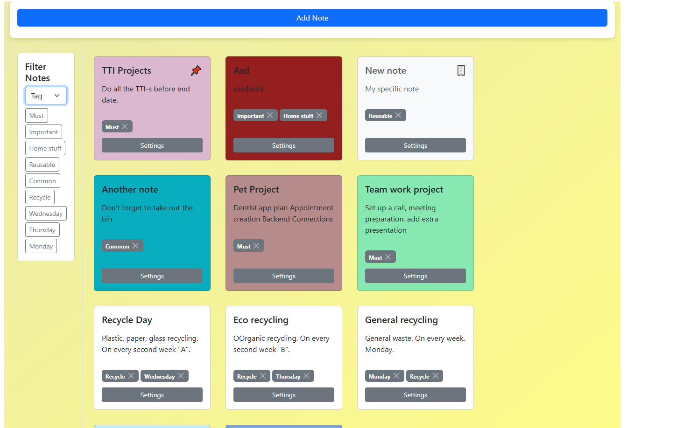
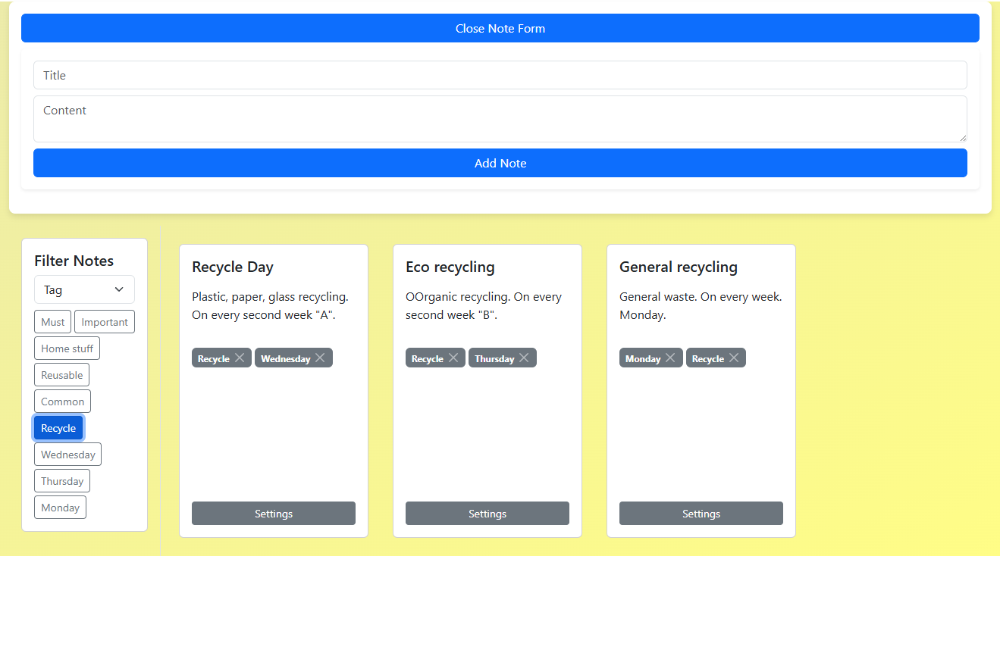
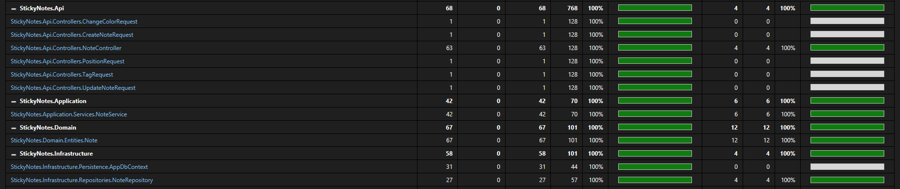

# 📝 Sticky Notes App

A modern, full-stack **Sticky Notes** application built with **ASP.NET Web API** backend and **React** frontend. This project demonstrates a complete C# + React stack, including database interaction, REST API design, and responsive UI.  

---

## 📖 About The Project

Sticky Notes is a web app to manage personal notes efficiently. Users can create, pin, archive, color, tag, and delete notes. The app is responsive, interactive, and provides instant updates without page reloads.  

---

## 🚀 Core Features

- **📌 Pin/Unpin** – Keep important notes on top.  
- **🗄️ Archive/Restore** – Manage old notes efficiently.  
- **🖌️ Color Selection** – Customize note backgrounds.  
- **🏷️ Tags** – Add/remove tags for better organization.  
- **🗑️ Delete** – Permanently remove notes.  
- **🔄 Live updates** – Changes reflected immediately.  
- **🖥️ Responsive design** – Desktop and mobile-friendly.  

---

## 🖼️ Screenshot

  
  
  

---

## 🛠️ Built With / Tech Stack

- **Frontend:** React, Bootstrap 5, Axios  
- **Backend:** ASP.NET 8 Web API (C#)  
- **Database:** SQLite (dockerized or local file)  
- **Containerization:** Docker  

---

## ⚙️ Prerequisites / Dependencies

To run the project locally or via Docker, you will need:

- **Node.js** – version 18 or higher  
- **.NET 8 SDK** – for building and running the backend  
- **Docker & Docker Compose** – optional, but required if you want to run frontend and backend containers  

---
## ▶️ How to Run

You can run the Sticky Notes app either locally or using Docker.

### 1️⃣ Using Docker (Recommended)

1. Make sure Docker and Docker Compose are installed.
2. Clone the repository and navigate to the project root.
3. Build and start containers:

   docker-compose up --build

4. The app will be available at:  
   - Frontend: http://localhost:3000  
   - Backend API: http://localhost:8080/api/note

> Any changes in the database (`stickyNotes.db`) will persist thanks to the volume mapping.

## 🔮 Roadmap / Future Development

- Add user authentication & multi-user support  
- Add real-time collaboration via WebSockets  
- Add search and filter enhancements  
- Deploy to cloud environment for public access
- Date and micro functions